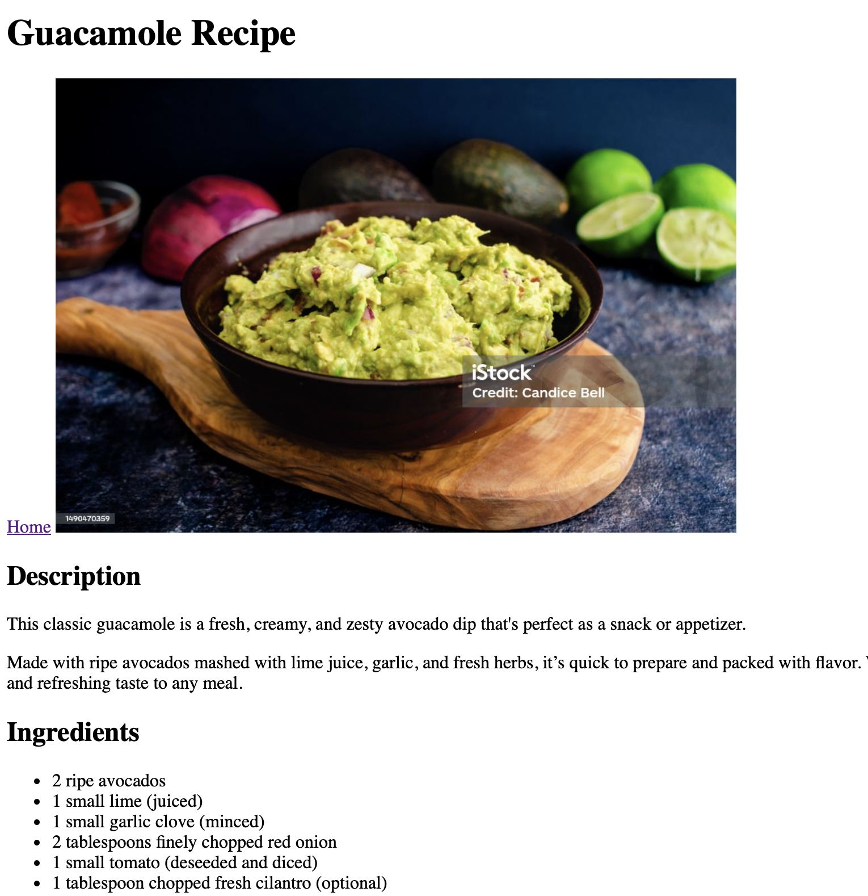

# 👨🏻‍🍳 A simple recipe website using HTML

## 🛠️ Built with

- HTML5 

### 📚 What I learned

In this section, I learned :

- How to structure an HTML document.
- How to use headings, lists (ordered & unordered)
- How to use relative & absolute links.
- How to use images.
- How to use Git & conventionnal commits.

## 👨🏻‍💻 Author

- Hideur Samy ([@Seppxku](https://github.com/Seppxku))